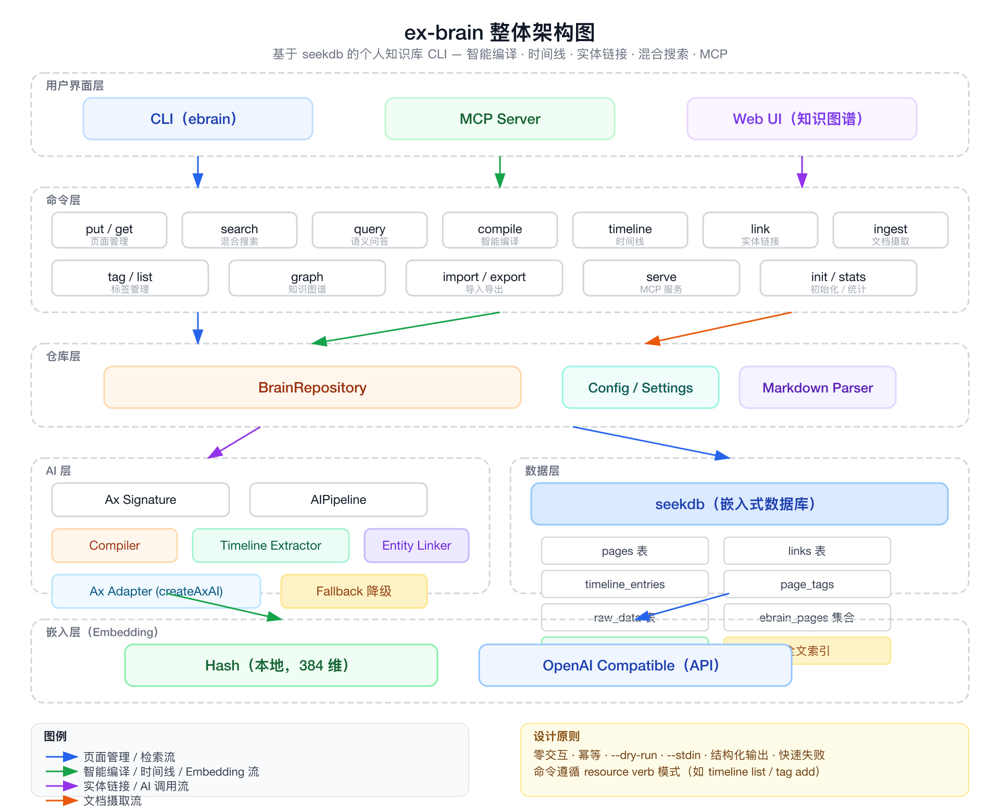

# ex-brain：让知识"活"起来的个人知识库 CLI

> 基于 [seekdb](https://docs.seekdb.ai/) 构建的本地优先个人知识库 CLI，核心能力包括智能编译（Smart Compilation）、时间线管理、实体链接、混合搜索、知识图谱可视化、文档摄取和 MCP Server。

---

## 一、为什么需要 ex-brain

市面上的知识管理工具大致分为两类：

**传统笔记**（Notion、Obsidian 等）——功能强大，但写入的内容不会自动"消化"。三个月前记的信息，今天看还是原样。想找关联、理脉络，全靠人工。

**AI 笔记**（Mem、Granola 等）——有 AI 帮你整理，但黑盒化严重，AI 怎么理解、怎么归类的逻辑你无法控制，且整理往往只发生在写入那一刻。

ex-brain 的想法是：**如果知识库能像人脑一样，每次写入新信息都自动"更新认知"、自动"建立关联"、自动"记录演变"呢？**

它围绕一个核心概念运作——**Compiled Truth（编译后的真相）**：知识库不是被动存储，而是主动编译。新信息进来，系统判断它是状态更新、新增事实还是历史事件，然后分别处理，最终生成一份"当前最准确的真相"。

---

## 二、适用场景

ex-brain 覆盖了从个人知识管理到 AI Agent 集成的完整场景链路：

### 场景一：个人知识管理

笔记散落在多处、难以检索和关联？`ebrain put` 按 `type/slug` 分类写入，`ebrain search` 全文+语义混合搜索，`ebrain tag` 打标签过滤。

```bash
ebrain put notes/golang-goroutine --type note --file goroutine.md
ebrain search "goroutine 最佳实践"
ebrain tag add notes/golang-goroutine go concurrency
```

### 场景二：公司动态追踪

投资人/分析师跟踪公司融资、人事变动、产品发布时，信息容易堆积。ex-brain 的**智能编译**自动区分信息类型：

- **状态更新**（融资阶段 Seed → Series A）→ 替换旧值，旧值归档到 History
- **事实信息**（成立于 2020 年）→ 追加并持久保留
- **事件信息**（发布新产品）→ 记录到时间线
- **纠正信息**（CEO 从 A 换成 B）→ 替换并标记冲突

### 场景三：项目文档管理

项目经理/技术负责人管理 PRD、技术方案、会议纪要时，使用 `ebrain put --file` 自动摄取 PDF/Word/HTML，或一条 `ebrain smart-ingest` 完成编译+时间线+实体链接的全流程。

### 场景四：人物关系网络

HR/投资人/研究员用 `ebrain link` 建立实体关系，`ebrain graph` 可视化知识图谱，一眼看清"谁是谁的创始人、谁投资了谁、哪些公司在竞争"。

### 场景五：研究资料整理

研究员/学生用 `ebrain import` 批量导入整个目录，混合搜索精准定位，语义问答快速获取综合回答。

### 场景六：AI 辅助问答（RAG）

配置 LLM 后，`ebrain query --llm "问题"` 自动完成语义搜索→多层上下文收集→LLM 合成回答，输出带 `[[slug|title]]` 来源引用的答案。

### 场景七：AI Agent 集成

`ebrain serve` 启动 MCP Server，提供 20+ 工具（读页面、写页面、搜索、编译、链接、时间线等），Claude Desktop 或其他 MCP 客户端可直接操作你的本地知识库。

### 场景八：自动化流水线

CLI 支持管道输入、JSON 输出和 `--dry-run` 预览，所有写操作幂等可重复，轻松集成到脚本和 CI/CD 中。

---

## 三、核心用法

### 3.1 安装与初始化

```bash
# 全局安装
bun install -g ex-brain   # 或 npm install -g ex-brain

# 初始化（自动创建 ~/.ebrain/data/ebrain.db）
ebrain init
```

### 3.2 写入知识

```bash
# 写入笔记（幂等 upsert，重复执行不产生副作用）
ebrain put companies/river-ai --type company --file intro.md

# 管道输入
cat article.md | ebrain put articles/my-article --stdin
```

### 3.3 智能编译（核心能力）

```bash
# 将新信息编译到已有页面
ebrain compile companies/river-ai \
  "River AI 完成 A 轮融资，红杉资本领投，5000 万美元" \
  --source news --date 2024-05-20
```

编译后页面自动生成结构化的 Compiled Truth：

```markdown
## Status
- **Funding Stage**: Series A (Source: news, 2024-05-20)
- **Valuation**: ~$50M (Source: news, 2024-05-20)

## History
- 之前是 Seed（到 2024-05-20 为止）

## Facts
- A 轮领投方：红杉资本
- 成立于 2020 年
```

### 3.4 智能摄取（一步到位）

```bash
# 编译 truth + 提取时间线 + 创建实体链接，全自动
ebrain smart-ingest companies/river-ai --file article.md --source web_clip
```

### 3.5 文档摄取（多格式支持）

```bash
# 支持 PDF、Word(.docx)、HTML、JSON、Markdown、纯文本
ebrain put --file report.pdf
ebrain put --file meeting-notes.docx
ebrain put --file https://example.com/whitepaper.pdf
ebrain put --file article.html              # HTML -> readable Markdown
cat article.html | ebrain put clips/article --stdin --format html
```

格式自动识别（参数指定 → HTTP Content-Type → 文件扩展名 → magic bytes → UTF-8 兜底）。

### 3.6 检索与问答

```bash
# 混合搜索（全文 + 语义）
ebrain search "transformer 模型架构"

# 语义查询
ebrain query "transformer 模型的核心创新是什么？"

# AI 问答（RAG，自动构建多层上下文）
ebrain query --llm "River AI 的主要产品是什么？"
ebrain query --llm "Q4 发生了哪些重要事件？" --context-limit 3
```

### 3.7 时间线管理

```bash
# 查看页面时间线
ebrain timeline list companies/river-ai

# AI 从页面内容自动提取事件
ebrain timeline extract companies/river-ai

# 手动添加事件
ebrain timeline add projects/alpha \
  --date 2024-05-20 \
  --summary "决定采用 Go 作为后端语言" \
  --source meeting

# 全局时间线
ebrain timeline list --limit 50
```

### 3.8 实体链接与知识图谱

```bash
# 建立实体关系
ebrain link people/sarah-chen companies/river-ai --context "CEO"

# 查看反向链接
ebrain backlinks companies/river-ai

# 启动知识图谱可视化 Web UI（暗色主题，交互式）
ebrain graph                    # http://localhost:3000
ebrain graph --port 8080 --open # 自定义端口 + 自动打开浏览器
```

### 3.9 MCP Server

```bash
# 启动 MCP Server
ebrain serve
```

Claude Desktop 配置：

```json
{
  "mcpServers": {
    "ebrain": {
      "command": "ebrain",
      "args": ["serve"]
    }
  }
}
```

### 3.10 配置管理

集中配置在 `~/.ebrain/settings.json`：

```jsonc
{
  "db": {
    "path": "~/.ebrain/data/ebrain.db",     // 本地模式（默认）
    "remote": {                              // 填了 host 即启用远程模式
      "host": "127.0.0.1",
      "port": 3306,
      "user": "ebrain",
      "database": "ebrain"
    }
  },
  "embed": {
    "provider": "hash",                      // "hash"（本地）或 "openai_compatible"
    "baseURL": "https://dashscope.aliyuncs.com/compatible-mode/v1",
    "model": "text-embedding-v4",
    "dimensions": 1024,
    "apiKeyEnv": "DASHSCOPE_API_KEY"
  },
  "llm": {
    "baseURL": "https://coding.dashscope.aliyuncs.com/v1",
    "model": "qwen-plus",
    "apiKeyEnv": "DASHSCOPE_API_KEY"
  },
  "extraction": {
    "confidenceThreshold": 0.7               // 实体提取置信度阈值
  }
}
```

配置优先级：**CLI 参数 `--db`** > **环境变量 `EBRAIN_*`** > **settings.json** > **代码默认值**。

---

## 四、技术实现与架构

### 4.1 整体架构



```
┌─────────────────────────────────────────────────────┐
│                     用户界面                         │
│   CLI (ebrain)  │  MCP Server  │  Web UI (Graph)    │
├─────────────────────────────────────────────────────┤
│                     命令层                           │
│  put │ get │ search │ query │ compile │ timeline    │
│  link │ tag │ import │ export │ graph │ serve      │
├─────────────────────────────────────────────────────┤
│                     仓库层                           │
│           BrainRepository (brain-repo.ts)           │
├──────────────────┬──────────────────────────────────┤
│      AI 层       │         数据层                   │
│  Ax Signature    │    seekdb (嵌入式数据库)          │
│  AIPipeline      │    向量索引 (KNN)                │
│  GEPA 优化       │    全文索引                       │
│  智能编译        │    原始数据表                     │
│  时间线提取      │                                   │
│  实体链接        │                                   │
├──────────────────┴──────────────────────────────────┤
│                     嵌入层                           │
│     Hash (本地)  │  OpenAI Compatible (API)         │
└─────────────────────────────────────────────────────┘
```

### 4.2 数据层：seekdb 嵌入式数据库

ex-brain 选择 [seekdb](https://docs.seekdb.ai/) 作为底层数据库，原因在于：

- **嵌入式**：一个数据库文件即可运行，无需搭建数据库服务
- **混合检索**：原生支持全文搜索 + 向量语义搜索，无需拼凑两套系统
- **嵌入函数集成**：内置 embedding 接口，支持 OpenAI 兼容 API 和本地 Hash
- **SQL 兼容**：使用熟悉的 SQL 语法
- **远程模式**：可通过配置连接到远程 seekdb 服务实现团队共享

**数据模型**包含 6 张关系表和 1 个检索集合：

| 表/集合 | 用途 |
|---------|------|
| `pages` | 知识页面（slug、title、compiled_truth） |
| `links` | 实体间关联关系 |
| `timeline_entries` | 时间线事件记录 |
| `page_tags` | 页面标签 |
| `raw_data` | 原始来源数据，支持追溯 |
| `ingest_log` | 文档摄取日志 |
| `ebrain_pages` | 向量+全文混合检索集合 |

### 4.3 AI 层：Ax Signature + AIPipeline


ex-brain 的 AI 能力全部基于 **Ax Signature + GEPA 框架** 构建，通过统一的 `AIPipeline` 封装完整的 LLM 调用生命周期：

```
createAxAI → guard → forward → parse → transform → fallback
```

**AIPipeline** 将每个 AI 模块简化为纯配置（signature + 映射函数），消除了大量样板代码：

```typescript
const pipeline = new AIPipeline<TInput, TRaw, TResult>({
  signature: entitySig,     // 定义输入输出形状
  mapInput: (input) => ..., // 映射输入
  parseRaw: ...,            // 解析 LLM 输出
  transform: ...,           // 转换为领域对象
  fallback: ...,            // LLM 不可用时的降级方案
  label: "Entity extraction",
});
```

AI 层提供三大核心能力：

#### 智能编译（Compiler）

`ebrain compile` 调用 `compileTruth()`，由 LLM 分析新信息类型（状态更新、新增事件、纠正、确认、新实体），智能合并到页面的 Compiled Truth 中，自动处理追加、更新、替换和冲突。

#### 时间线提取（Timeline Extractor）

`ebrain timeline extract` 调用 `extractTimelineEvents()`，从非结构化文本中自动提取事件，支持多种日期格式（ISO、中文、英文月份、相对日期），并对事件进行重要性分级。

#### 实体链接（Entity Linker）

`ebrain link` 和 `ebrain smart-ingest` 调用 `extractRelations()`，自动识别文本中的实体关系，支持 10 种关系类型（创始人、工作地、领导、合作、竞争、收购、隶属、投资、提及、相关），并按置信度阈值过滤。

### 4.4 嵌入层

嵌入服务支持两种模式：

| 模式 | 说明 | 维度 | 网络依赖 |
|------|------|------|----------|
| `hash` | 确定性本地 Hash 向量 | 384 | 无 |
| `openai_compatible` | OpenAI 兼容 API（如 DashScope） | 可配置 | 有 |

若选择 `openai_compatible` 但未提供 Key，系统会自动警告并回退到 Hash 模式。嵌入和 LLM 使用独立的 baseURL 和 API Key，互不干扰。

### 4.5 检索层：混合搜索 + RAG

**混合搜索**将全文匹配和向量语义搜索结合，搜索结果按以下权重综合评分：

- 语义匹配（85%）— 向量相似度
- 新鲜度加成（10%）— 最近更新的内容权重更高
- 类型影响（5%）— 特定类型的内容优先

**RAG 问答**（`query --llm`）构建多层上下文：

1. 语义搜索找到最匹配的页面
2. 收集页面 Compiled Truth + 时间线 + 原始文档
3. 获取入链和出链页面，按语义相关性过滤
4. LLM 合成回答，附带 `[[slug|title]]` 来源引用

搜索查询进入 seekdb 前会经过**安全清理**（去除特殊字符），向量搜索失败时自动回退到 SQL LIKE 搜索，确保操作不中断。

### 4.6 设计原则

| 原则 | 说明 |
|------|------|
| **零交互** | 所有输入通过 flag 或 stdin，AI Agent 可安全调用 |
| **幂等性** | `put`、`link`、`tag add` 重复执行不产生副作用 |
| **--dry-run** | 所有写操作支持预览，不实际修改数据 |
| **--stdin** | `put`、`raw set` 支持管道输入；`put --stdin --format html` 支持长 HTML 字符串 |
| **结构化输出** | `--json` 统一输出 JSON，供脚本解析 |
| **快速失败** | 缺少必要参数时立即报错并给出用法示例 |
| **命令可预测** | 统一 `resource verb` 模式（如 `timeline list`） |

### 4.7 技术栈

| 组件 | 技术 |
|------|------|
| 运行时 | Bun / Node.js |
| 数据库 | seekdb（嵌入式，混合检索） |
| AI 框架 | @ax-llm/ax（Ax Signature + GEPA） |
| MCP SDK | @modelcontextprotocol/sdk |
| CLI 框架 | commander |
| PDF 解析 | unpdf（基于 PDF.js） |
| Word 解析 | mammoth |
| Markdown 解析 | gray-matter |
| JSON 修复 | jsonrepair |
| 知识图谱 | vis.js Network |
| 语言处理 | pinyin-pro（拼音转换） |
| 类型校验 | zod |

---

## 五、典型工作流

### 投资尽调工作流

```bash
# 1. 初始化公司页面
ebrain put companies/target-co --type company --file company-intro.md

# 2. 批量导入尽调资料
ebrain import ./due-diligence/

# 3. 智能编译访谈记录
ebrain compile companies/target-co "CTO 表示团队 80 人，研发占比 70%" --source interview

# 4. 建立实体关系
ebrain link people/founder-name companies/target-co --context "Founder & CEO"

# 5. AI 问答总结
ebrain query --llm "Target Co 的团队规模和研发投入如何？"

# 6. 知识图谱可视化
ebrain graph --open

# 7. Claude Desktop MCP 自动持续更新
```

### 个人学习知识库

```bash
# 1. 浏览器剪藏文章 → MarkSnip → 导入
cat article.md | ebrain put notes/article-slug --stdin

# 2. 摄取 PDF 论文
ebrain put papers/slug --file research-paper.pdf

# 3. 智能整理（编译 + 时间线 + 实体链接一步到位）
ebrain smart-ingest topics/machine-learning --file textbook-chapter.md

# 4. 检索与问答
ebrain search "attention mechanism"
ebrain query --llm "解释 transformer 的 self-attention 机制"
```

---

## 六、与同类工具对比

| 能力 | ex-brain | Obsidian | Notion | Logseq |
|------|----------|----------|--------|--------|
| 本地优先 | ✅ | ✅ | ❌ | ✅ |
| 智能编译（自动更新知识） | ✅ | ❌ | ❌ | ❌ |
| 时间线自动提取 | ✅ | ❌ | ❌ | ❌ |
| 实体关系图谱 | ✅ | 插件 | ❌ | 基础 |
| 混合搜索（全文+语义） | ✅ | 插件 | 全文 | 全文 |
| MCP Server（AI Agent） | ✅ | 插件 | ❌ | ❌ |
| CLI 自动化 | ✅ | ❌ | ❌ | ❌ |
| 多格式文档摄取 | ✅ | 手动 | 手动 | 手动 |
| AI 自动实体链接 | ✅ | ❌ | ❌ | ❌ |
| 开源 | ✅ | ❌ | ❌ | ✅ |

---

## 七、快速选型指南

| 你的需求 | 使用命令 |
|----------|----------|
| 写入笔记 | `ebrain put <slug> --file <path>` |
| 更新已有知识（智能） | `ebrain compile <slug> <info> --source <src>` |
| 一步到位（编译+时间线+链接） | `ebrain smart-ingest <slug> --file <path>` |
| 处理 PDF/Word/HTML 文档 | `ebrain put --file <file>` |
| 搜索知识 | `ebrain search <query>` |
| 语义问答 | `ebrain query <question>` |
| AI 问答（LLM 合成） | `ebrain query --llm <question>` |
| 查看/提取时间线 | `ebrain timeline list` / `extract` |
| 建立实体关系 | `ebrain link <from> <to> --context <desc>` |
| 可视化知识图谱 | `ebrain graph` |
| AI Agent 集成 | `ebrain serve` |
| 批量导入 | `ebrain import <dir>` |

---

*ex-brain 是开源项目，MIT 许可证。GitHub: [ex-brain](https://github.com/)*
